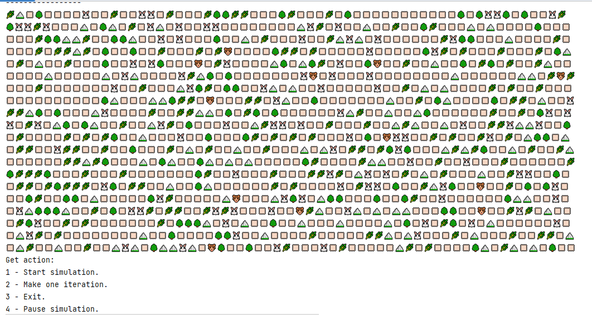
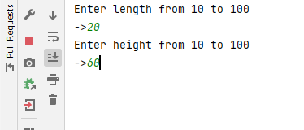
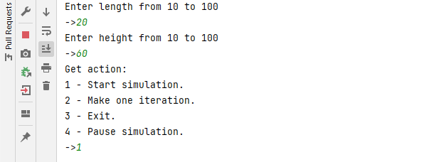
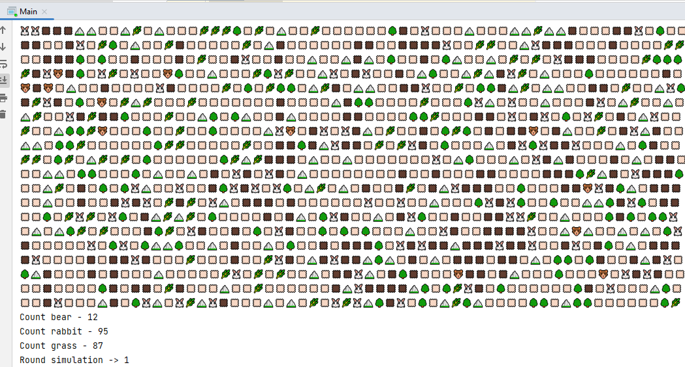
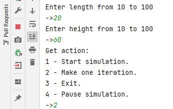
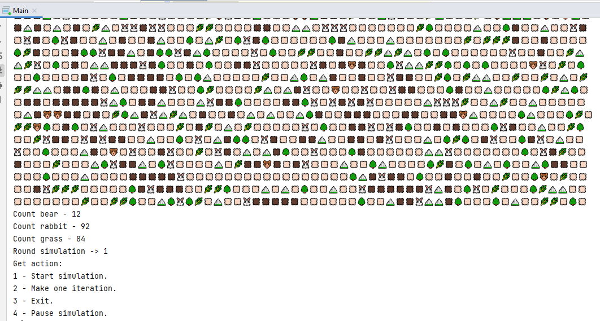
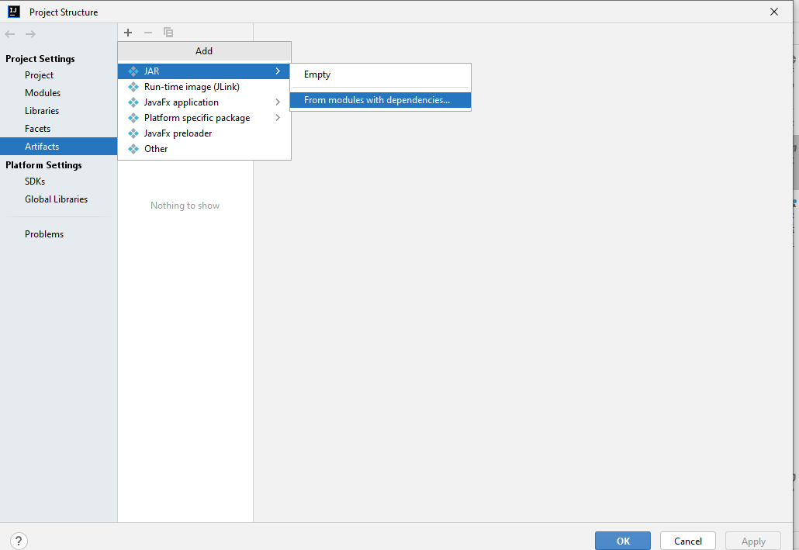
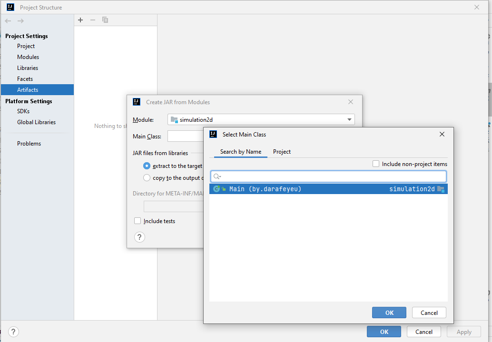

# Simulation
Тренировочный проект из Java Роадмап Сергея Жукова: https://zhukovsd.github.io/java-backend-learning-course/

## Цель проекта:
Отработка ООП - кода.

### Краткое описание 
Проект представляет собой 2D мир, населенный животными (хищники, травоядные) и статическими объектами (трава, камни, деревья). Животные ищут ближайший к ним ресурс. Поиск осуществляется с помощью алгоритма BFS.

### Описание процесса:
-Сначала мы выбираем размеры мира от 10 до 100 клеток по длине или высоте.

-В выповшем меню выбераем 1 для симуляции мира.

-Симуляция будет продолжаться бесконечно добавляе ресурсы.

-Для выбора генерации одного шага нужно выбрать 2 или выбрать паузу 4 если генерация мира запущена затем выбрать 2.

-Передвижение животных (далее Animal) осуществляется по-разному. Кролик (далее Rabbit) передвигается по четырем направлениям: вверх, вниз, вправо, влево. Медведь (далее Bear) может передвигаться в восьми направлениях: вверх, вниз, вправо, влево и по диагонали.

-Каждое существо имеет скорость. Скорость представляет из себя количество клеток, которое сущетсво может пройти за один ход.

-Каждое существо стремится найти ближайшую для себя жертву (далее target). Для хищников ресурс - травоядные, для травоядных - трава.

-На передвижение каждое существо тратит некое количество энергии (energy), а поглощение жертвы его восполняет (но не может превысить его максимальное значение).

### Поглощение ресурсов

Animal подходит к цели и проводит атаку по ней:

-Rabbit уничтожает свою цель становится на ее место и восполняет энергию со здоровием.

-Bear проводит атаку по броне цели если он ее пробивает далее наносит урон по здоровью цели, если здоровье дошло до нуля bear становиться на клетку цели восполняет эргию и здоровье, в противном случае остается возле цели до следующего хода.
При условии что броня цели не пробита Bear получает урон который ему наносит цель.

-Чтобы дать травоядным больше шансов на выживание, их скорость передвижения в 2 раза больше, чем у хищников.

-В симуляции реализован метод постоянного пополнения ресурсов на карте.

-При исчерпании ресурсов животным, реализована метод уменьшении энэргии который при достижении минимального уровня начинает наносить урон с каждым ходом. 

-Симуляция завершается при выборе 3 в меню.

## Сборка 
Перейдите в File -> Project Structure -> Artifacts.

Нажмите на + и выберите JAR -> From modules with dependencies 

Выберите ваш главный класс (Main) и нажмите OK.

Убедитесь, что в разделе Output Directory указана правильная папка для сохранения JAR-файла.

## Компиляция проекта:

Перейдите в Build -> Build Artifacts.

Выберите созданный артефакт и нажмите Build.

## Запуск JAR-файла через командную строку:

Откройте командную строку (CMD).

Перейдите в директорию, где находится ваш JAR-файл.

Запустите JAR-файл: java -jar simulation2d.jar

